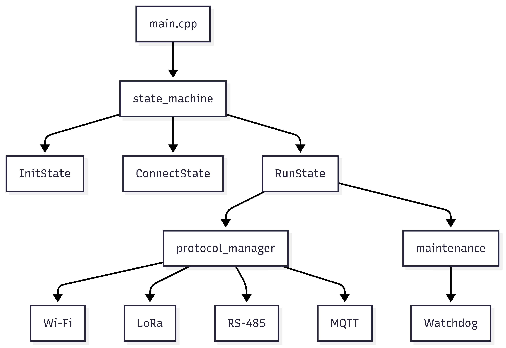
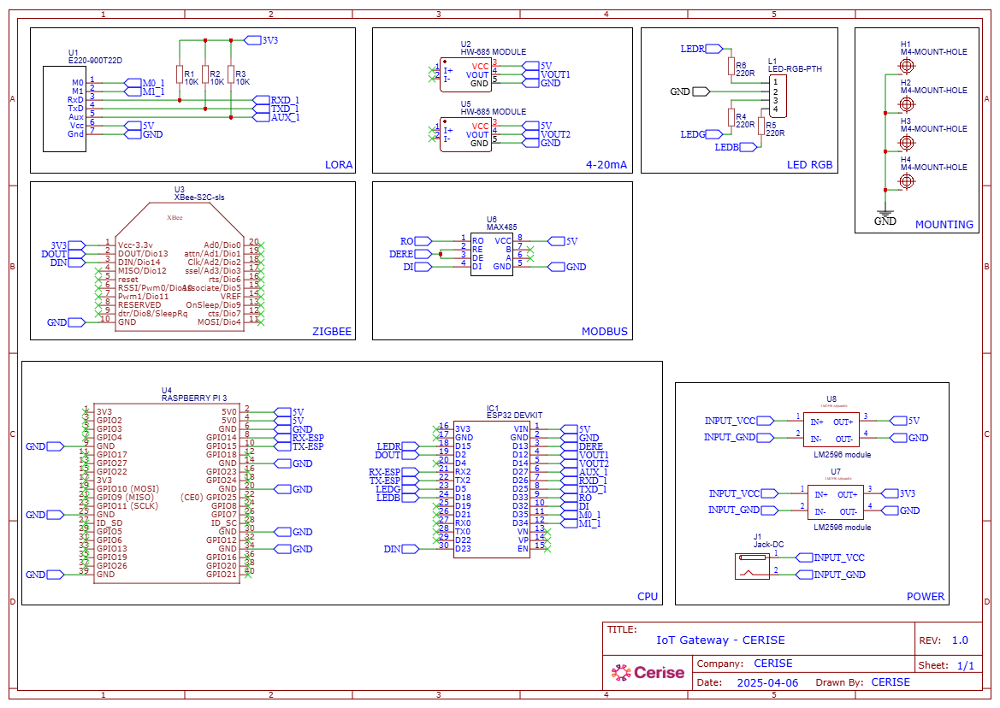
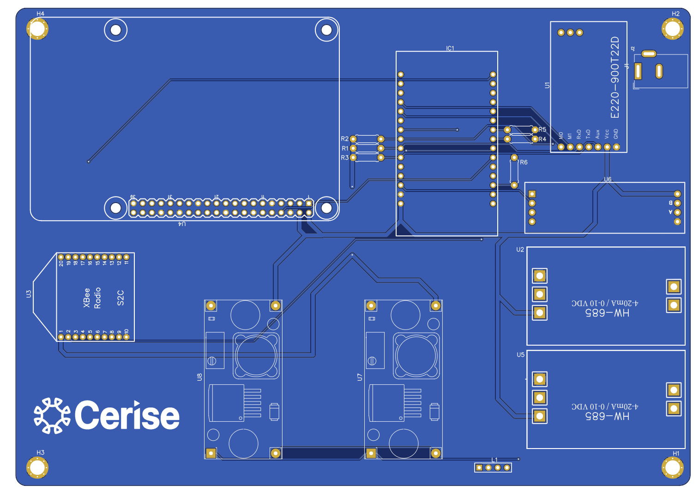

# Roteiro - CERISE Gateway Firmware

## 1. Descrição do Projeto

**Nome:** CERISE Gateway Firmware

**Objetivo:**  
Desenvolver um gateway IoT modular para ESP32, capaz de integrar múltiplos protocolos de comunicação (Wi-Fi, LoRa, RS-485, MQTT), coletar dados de sensores e encaminhá-los para a nuvem, com foco em robustez, flexibilidade e fácil manutenção.

**Motivação:**  
Projetado para ambientes industriais, automação residencial e aplicações que exigem integração de diferentes tecnologias de comunicação, o gateway permite centralizar, processar e encaminhar dados de sensores e atuadores de forma eficiente e segura.

---

## 2. Funcionalidades

- Comunicação via **Wi-Fi**, **LoRa**, **RS-485** e **MQTT**.
- Coleta de dados de sensores conectados localmente.
- Encaminhamento de dados para a nuvem via **MQTT** ou **HTTP**.
- Interface serial para debug e comandos locais.
- Sistema de watchdog para reinicialização automática em caso de falhas.
- Modularidade para fácil adição de novos protocolos.
- Gerenciamento de estados do sistema via máquina de estados.
- Reconexão automática em caso de perda de comunicação.

---

## 3. Arquitetura do Sistema

O firmware é organizado em módulos principais, cada um responsável por uma parte da funcionalidade do gateway:

- **main.cpp**: Ponto de entrada do sistema, inicializa módulos e a máquina de estados.
- **state_machine**: Gerencia os estados do sistema (inicialização, conexão, operação, etc).
- **protocol_manager**: Abstrai e gerencia os diferentes protocolos de comunicação (Wi-Fi, LoRa, RS-485, MQTT).
- **maintenance**: Implementa rotinas de manutenção, watchdog e recuperação de falhas.
- **States/**: Implementação dos estados individuais da máquina de estados (Init, Connect, Run).

**Fluxo de Dados:**
1. O sistema inicia em `main.cpp`, inicializando a máquina de estados.
2. O estado de inicialização (`InitState`) configura hardware e protocolos.
3. O estado de conexão (`ConnectState`) estabelece links de comunicação (Wi-Fi, LoRa, etc).
4. O estado de operação (`RunState`) coleta dados dos sensores e encaminha para a nuvem.
5. O watchdog monitora o sistema e reinicializa em caso de falhas.

**Camada de Comunicação:**
- O `protocol_manager` abstrai o uso de diferentes protocolos, permitindo troca dinâmica e simultânea de dados via MQTT, LoRa, RS-485, etc.
- Reconexões e falhas são tratadas automaticamente, com tentativas de recuperação e logs via interface serial.

**Diagrama (Mermaid):**


---

## 4. Esquemático da PCB



---

## 5. Representação PCB



---

## 6. Componentes Utilizados

O gateway CERISE utiliza os seguintes componentes principais:

### **E220-900T22D**
- Módulo de comunicação LoRa de longo alcance
- Frequência: 900 MHz
- Ideal para comunicação IoT de baixa potência e longo alcance
- Suporte a protocolos LoRaWAN

### **HW-685 MODULE**
- Módulo conversor USB para RS-485/RS-422
- Interface de comunicação serial robusta
- Proteção contra surtos e isolamento galvânico

### **MAX485**
- Circuito integrado transceiver RS-485
- Comunicação half-duplex em redes industriais
- Resistente a ruídos e interferências

### **XBee-S2C-sls**
- Módulo de comunicação ZigBee/802.15.4
- Rede mesh de baixa potência
- Ideal para automação e IoT de curta distância

### **RASPBERRY PI 3**
- Computador de placa única para processamento avançado
- Sistema operacional Linux completo
- Interface com múltiplos protocolos de comunicação

### **ESP32 DEVKIT**
- Microcontrolador principal do gateway
- Wi-Fi e Bluetooth integrados
- Múltiplos pinos GPIO para sensores e atuadores
- Suporte a FreeRTOS

### **LM2596 Module**
- Regulador de tensão step-down (buck converter)
- Conversão eficiente de tensão para alimentação dos módulos
- Tensão de saída ajustável
- Alta eficiência energética

---

## 7. Estrutura do Projeto

- **src/**  
  - `main.cpp`: Inicialização do sistema e máquina de estados.
  - `state_machine.cpp/h`: Implementação da máquina de estados.
  - `protocol_manager.cpp/h`: Gerenciamento dos protocolos de comunicação.
  - `maintenance.cpp/h`: Rotinas de manutenção e watchdog.
  - **States/**:  
    - `InitState.*`: Estado de inicialização.
    - `ConnectState.*`: Estado de conexão.
    - `RunState.*`: Estado de operação.
    - `State.h`: Interface base para estados.

- **include/**  
  - Headers públicos dos módulos principais.

- **lib/**  
  - Dependências externas (gerenciadas pelo PlatformIO).

- **test/**  
  - Testes unitários e de integração.
  - `test_state_machine/test_main.cpp`: Testes para a máquina de estados.

- **platformio.ini**  
  - Configuração do ambiente PlatformIO, dependências e flags de build.

---

## 8. Requisitos

- **PlatformIO** instalado ([guia oficial](https://platformio.org/install))
- **Python 3** (requisito do PlatformIO)
- **Placa ESP32** (ex: ESP32 DevKit)
- **Bibliotecas** (instaladas automaticamente pelo PlatformIO):
  - PubSubClient (MQTT)
  - ArduinoJson
  - WebSockets
  - CoAP-simple-library
  - Adafruit NeoPixel
  - ESPAsyncWebServer
  - AsyncTCP
  - ModbusMaster (RS-485)
  - EspSoftwareSerial

---

## 9. Instalação

```bash
# Clone o repositório
git clone https://github.com/antonio-emilio/cerise-gw-firmware
cd cerise-gw-firmware

# Abra no VSCode com PlatformIO instalado
code .

# Compile e envie para a placa ESP32
platformio run --target upload

# Monitore a saída serial
platformio device monitor

# Execute os testes (ambiente nativo)
platformio test
```

